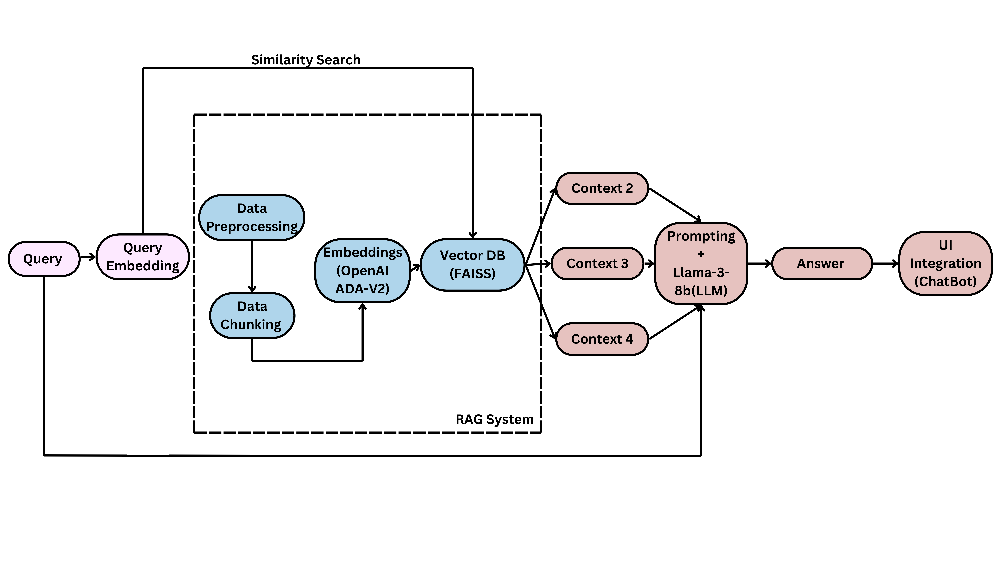

# Welcome To Boston Public School Policy Document Retrieval Chatbot

# Project Overview

Our project aims to supports Boston Public Schools by simplifying access to English language public policy information through an intuitive RAG-based chatbot. Acting as a virtual assistant, the chatbot helps staff find policy-related answers and documents quickly, saving time on administrative tasks. By organizing policy documents into searchable pieces and using smart retrieval tools, it delivers accurate, clear responses through a user-friendly interface. With a focus on privacy and reliability, the chatbot enhances decision-making and streamlines navigating complex policies.

# Public Policies

The following link provides access to the official policies of the Boston Public Schools. These policies cover a wide range of areas, including academic guidelines, student conduct, safety protocols, and other important regulations governing the operations of the school district.

You can view the complete list of policies and guidelines by visiting the link below:  
Link: [Boston Public Schools Policies](https://www.bostonpublicschools.org/domain/1884)

# Repository breakdown

The **`main`** branch of the repository contains several folders that document our progress throughout the project development lifecycle. Each folder represents a distinct phase of our work and provides a detailed snapshot of the progress made during that stage. The folders are organized in chronological order, allowing for a clear and systematic view of the project's evolution over time.

1. **`dataset-documentation:`** This folder contains a detailed README file that provides comprehensive information about the dataset used in the project. The documentation covers the following key aspects:

    *   Location: Where the dataset is stored and how to access it.
    *   Structure: A breakdown of the dataset's organization, including the types of data, fields, and how it is arranged.
    *   Composition: Detailed information about the content of the dataset, such as the number of records, data types (e.g., text, images, numerical values), and any associated metadata.
    *   Size: The overall size of the dataset, including the number of entries or files it contains, as well as the storage requirements.
    *   Usage: How the dataset is intended to be used within the project, including any necessary preprocessing steps.
    *   Purpose: The objective and relevance of the dataset in relation to the project's goals.

This documentation is designed to serve as a complete reference for understanding the dataset, ensuring clarity on its structure, composition, size, and application in the project.

2. **`project-outline:`** This folder contains the foundational outline of the project. It details our initial plans, objectives, and commitments made to the clients. The documents in this folder provide a clear understanding of the project's scope, goals, and the preliminary requirements necessary to achieve the desired outcomes. It serves as the starting point for defining the project's direction.

3. **`project-research:`** This folder houses the research phase of the project, where we explored and analyzed various reference papers to inform our strategy. During this phase, we identified key academic and industry resources that helped us refine our approach and establish a concrete project plan. The insights gained during this phase also contributed to the development of the project's pipeline, laying the groundwork for subsequent stages.

4. **`data:`** This folder contains the raw data used throughout the project. It includes files in different formats, such as:

    *   PDF: Documents in PDF format that are part of the dataset.
    *   Text: Plain text files containing extracted or processed data.
    *   JSON: Structured data stored in JSON format for easy parsing and integration.

These files represent the core data that is processed and utilized in the project, serving as the foundation for further analysis and model development.

5. **`project-eda:`** This folder documents the Exploratory Data Analysis (EDA) conducted on the project's dataset. The EDA process began with scraping links from a website, followed by downloading files from Google Drive links. Our analysis focused exclusively on documents in English. We extracted text from PDF files, stored the content as .txt files, and performed tokenization and lemmatization to preprocess the data. Various EDA techniques were applied to better understand the dataset, including generating word clouds, analyzing word frequencies, creating histograms, conducting Latent Dirichlet Allocation (LDA) for topic modeling, and more.

6. **`project-poc:`** This folder contains the Proof of Concept (PoC) for the project. Here, we implemented a basic version of the Retrieval-Augmented Generation (RAG) model, which served as a foundational prototype. This rudimentary implementation allowed us to structure and refine our approach. The PoC involved processing text data into metadata chunks structured as 'folder_name', 'file_name', 'chunk_id', 'uri', 'content'. We utilized the Hugging Face transformer model all-MiniLM-l6-v2 to generate embeddings, which were stored in a FAISS vector database. The PoC demonstrated the ability to retrieve the top four relevant chunks from the database in response to policy-related questions, providing a baseline for further improvements.

7. **`project-UI:`** This folder showcases the work we performed beyond the original project scope by implementing a user interface (UI) for the chatbot model. We utilized Chainlit as the primary framework for creating an interactive and visually appealing UI. Chainlit allowed us to seamlessly integrate the chatbot's backend with its frontend components. To enhance functionality and modularity, we incorporated FastAPI, a high-performance web framework, to handle API endpoints and manage the communication between the chatbot logic and the frontend. Additionally, we leveraged iframe components to embed interactive elements, ensuring the UI was both dynamic and user-friendly. This implementation made the model accessible to end-users while maintaining flexibility for future customizations or enhancements.

8. **`project-chatbot:`** This folder contains the final implementation of the complete project pipeline, integrating all previous steps and additional refinements. At its core, the pipeline leverages LangChain, a powerful framework for developing applications with language models.

    1. Retrievers: We employed retrievers to fetch the most relevant pieces of information from the dataset based on user queries. This step ensures that the chatbot delivers precise and contextually accurate responses. The retrievers utilized embeddings stored in the FAISS vector database to identify and return relevant metadata chunks efficiently.

    2. Generators: Generators were used to synthesize coherent and detailed responses by combining the information retrieved with the capabilities of the language model. This step involved transforming retrieved chunks into human-readable answers tailored to the user's query.

To further enhance interaction, we incorporated an LLM agent as the final layer. This agent acts as an intermediary between the user and the RAG pipeline, utilizing advanced prompts to interpret user queries, orchestrate retrieval and generation tasks, and deliver polished, human-like responses. The implementation not only ensures accuracy but also prioritizes user experience by making responses intuitive and easy to understand.

This folder represents the culmination of our efforts, showcasing a robust, end-to-end solution capable of handling complex queries, retrieving relevant data, and generating high-quality outputs. The modularity of the design ensures scalability and adaptability for future enhancements.

# Project Pipeline

# Installation Instructions  

Follow the steps below to set up and configure the environment for the chatbot:  

## Step 1: Install Required Dependencies  
Run the following command to install the necessary dependencies:  
```bash
pip install -r requirements.txt
```  

If you encounter issues with `torch` or its dependencies, use the following command to manually install the required PyTorch packages:  
```bash
pip3 install --pre torch torchvision torchaudio --extra-index-url https://download.pytorch.org/whl/nightly/cpu
```  

## Step 2: Set Up Environment Variables  
Create a `.env` file in the root directory of the project and add the following lines:  
```bash
export OPENAI_API_KEY='your-openai-api-key'
export LANGCHAIN_API_KEY='your-langchain-api-key'
export LANGCHAIN_TRACING_V2="true"
```  
Replace `'your-openai-api-key'` and `'your-langchain-api-key'` with your actual API keys.  

This application runs well for python verisons > 3.8, up til version specified in 'python_version.txt'

## Step 3: Run the Chatbot Application  
Start the chatbot by running the following command:  
```bash
uvicorn code.main:app --reload --port 8000
```  
The application will run on port `8000` by default. If you want to use a different port, replace `8000` with your preferred port number.  

## Usage  
After completing these steps, the chatbot will be accessible via the specified port. You can interact with it using the user interface or API endpoints.  

By following these instructions, you will have the chatbot configured and ready to use seamlessly.  

**Contributors:**  
Akshat Gurbuxani  
Abhaya Shukla  
Akuraju Mounika Chowdary  
Duoduo Xu